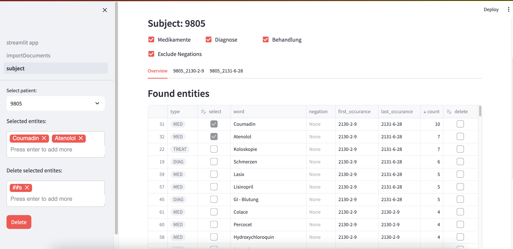
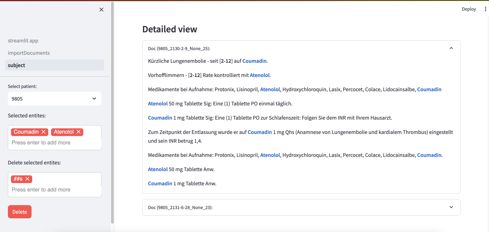
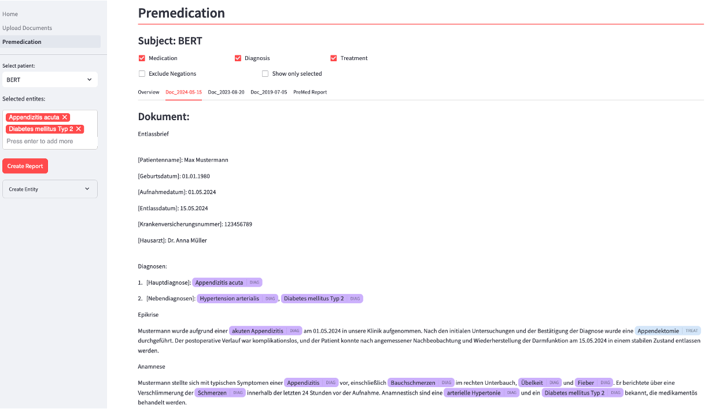

# medicaApp
The MEDICA app allows users to analyze multiple clinical documents by tagging named entities such as drugs, treatments, and diagnoses. It provides an aggregated overview of all documents, highlights detected entities, and enables users to remove incorrect tags and generate reports based on selected entities.

<br>
<br>
<br>

# Prerequisites
<b>Install requirements</b><br>
To install the required Python packages, run the following command in your activated Python environment: `pip install -r requirements.txt`.<br>

<b>Integrate Transformer Models</b><br>
The application supports `AutoPeftModelForCausalLM` and `AutoModelForTokenClassification` transformer models.
You can configure the model IDs in the `app_config.json` file. The LLM is prompted using the Alpaca instruction schema, but the prompt and model can be easily customized in `nlp_pipe.py`<br>

<b>Negation Detection package</b><br>
Ensure that the `negex` python package and German medical trigger set to this repository. Follow the steps in `negex/`.

# Start the app
In order to run the streamtlit application you must set an environment variable to the data directory.
```bash
export app_data=/your/dataDir/data
export APP_CONFIG=/pathTo/app_config.json
```

Then you can start the app
```bash
streamlit run streamlit_app.py --server.fileWatcherType none
```

